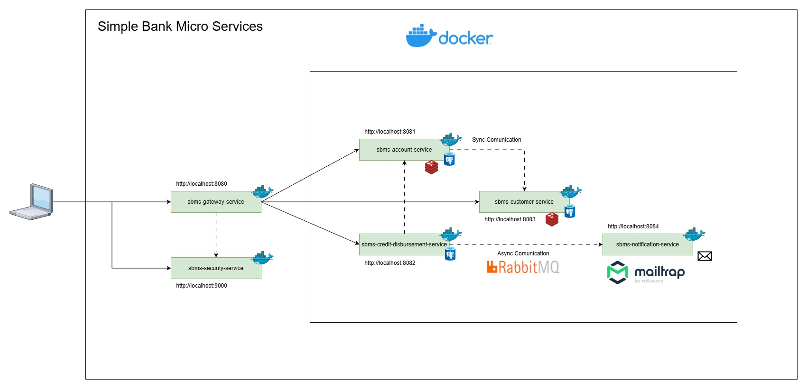

# Simple Bank Micro Services

## ¿Qué es? 
Es un proyecto que encaré a modo de práctica de construcción de microservicios conectados entre sí a través de llamadas sincronicas (Feign) y asincronicas (RabbitMQ) y desplegados en Docker (y proximamente kubernetes).

## ¿Que tecnologías usa (al momento)?
1. Java 21
2. Spring boot 2025.1.0
3. Spring Data JPA 2025.1.0 (+ PostgreSQL)
4. Spring Security 2025.1.0 + OAuth2
5. Spring Cloud 2025.1.0 + Resilience4j (Circuit Breaker)
6. RabbitMQ + AMPQ
7. Database caching using Redis
8. Docker Compose
9. Mailtrap.io (Plataforma de envio de mails SMTP)

## ¿Que recursos utilizaste para armarlo?
Me basé principalmente en un tutorial de Stive Tech que encontré y me pareció super valioso, ya que explica a detenimiento los conceptos de microservicios que estaba buscando. El link a la playlist es el siguiente: [Playlist Stive Tech](https://www.youtube.com/playlist?list=PLkiIEFVLQKqjy2aIGfHlNAe51TC1wlIYt).
Algunos apartados fueron modificados de la guía, por ejemplo el servicio utilizado para colas de mensajería, donde en el tutorial se sugería Azure Service Bus y se cambió a RabbitMQ, utilizando la siguiente guía: [Quick setup & implementation of RabbitMQ using Spring Boot 3.0 & Java 17](https://medium.com/@pkumarsaha71/quick-setup-implementation-of-rabbitmq-using-spring-boot-3-0-java-17-3b637c8adece).

## ¿Como se levanta todo esto?
1. Primero, tendrás que levantar los container de PostgreSQL y RabbitMQ utilizando el siguiente comando en una consola de windows*:
`docker compose up -d`
2. Será necesario levantar cada servicio, utilizando sobre cada uno el siguiente comando:
`mvn spring-boot:run`

* Para macOS/Linux será necesario adaptar los comandos aquí descritos

## Endpoints disponibles
### sbms-customer-service
- (GET) /customers
- (POST) /customers
- (GET) /customers/cu/{cu}

### sbms-account-service
- (GET) /accounts
- (PUT) /accounts
- (POST) /accounts

### sbms-credit-disbursement-service
- (GET) /credit-disbursements
- (POST) /credit-disbursements

## ¿En qué puertos reside cada microservicio?
- sbms-customer-service: {localhost}:8083
- sbms-account-service: {localhost}:8081
- sbms-credit-disbursement-service: {localhost}:8082
- sbms-notification-service: {localhost}:8084
- sbms-gateway-service: {localhost}:8080
- sbms-security-service: {localhost}:9000

## Documentacion adicional
1. Coleccion de postman: ./SimpleBankMicroServices WIP.postman_collection.json (WIP)
2. Diagrama en draw.io del estado actual: ./diagrama_arq_sbms.drawio (WIP)

